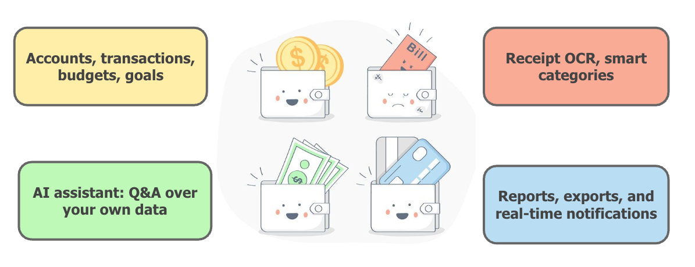
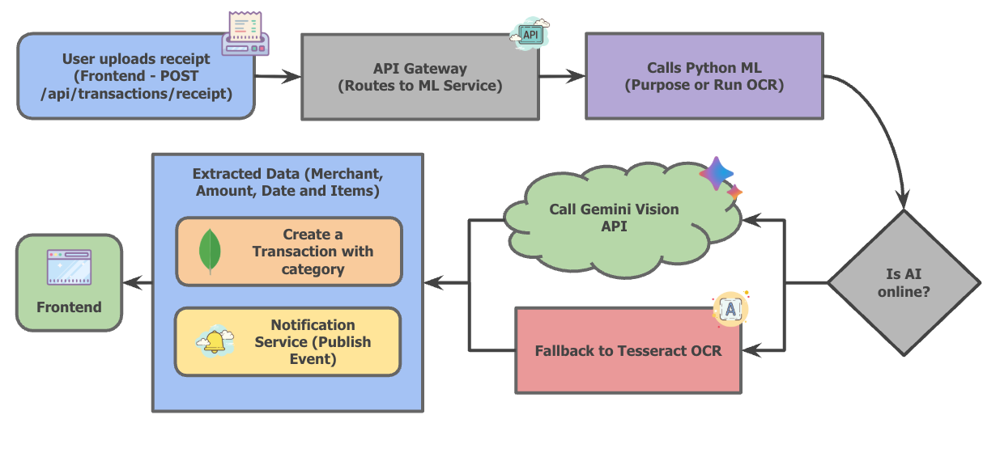

# FinForesight

<div align="center">

**A modern, intelligent financial management platform built with microservices architecture**

[](https://opensource.org/licenses/ISC)
[](https://nodejs.org/)
[](https://www.typescriptlang.org/)
[](https://nextjs.org/)

[Features](#features) • [Architecture](#architecture) • [Getting Started](#getting-started) • [API Docs](#api-documentation)

</div>

---

## Overview

FinForesight is a comprehensive financial management application with AI-powered insights, real-time tracking, and predictive analytics. Built with microservices architecture for scalability and maintainability.

---

## Features

- **Multi-Account Management** - Checking, savings, credit cards, cash, and investment accounts
- **Budget Tracking** - Category-based budgets with real-time spending alerts
- **Financial Goals** - Set and track savings goals with progress visualization



- **Transaction Management** - Full CRUD with AI-powered categorization
- **Receipt OCR** - Upload receipts with Google Gemini Vision API for automatic data extraction


- **Recurring Bills** - Automated bill tracking and payment reminders
- **AI Financial Assistant** - Natural language queries about your finances using Gemini Flash
- **Cash Flow Forecasting** - Predictive balance projections and low balance warnings
- **Financial Reports** - Monthly/yearly summaries with CSV, PDF, Excel, JSON exports
- **Real-Time Notifications** - WebSocket-based alerts for budgets, goals, and system updates

---

## Architecture

### Microservices Architecture

```
Frontend (Next.js) → API Gateway (3000)
    ├── Auth Service (3008) - Authentication & JWT
    ├── Transaction Service (3002) - Transactions, receipts, reports
    ├── Account Service (3005) - Multi-account management
    ├── Budget Service (3006) - Budget tracking & alerts
    ├── Goal Service (3007) - Financial goals
    ├── ML Service (3003) - AI assistant, forecasting, categorization
    └── Notification Service (3004) - WebSocket notifications

Infrastructure:
    ├── MongoDB (27017) - Primary database
    └── Redis (6379) - Sessions, caching, rate limiting
```

### Design Decisions

- **Microservices**: Independent scaling, deployment, and fault isolation
- **API Gateway**: Single entry point with centralized auth, rate limiting, and routing
- **JWT Authentication**: Short-lived access tokens (15m) + refresh tokens (7d) with rotation
- **Shared Infrastructure**: Common models, middleware, and utilities in `backend/shared/`
- **Security**: Rate limiting, CSRF protection, input sanitization, account lockout after 5 failed attempts

---

## Tech Stack

**Frontend**: Next.js 16, React 19, TypeScript, Tailwind CSS, shadcn/ui, Zustand, React Query, Socket.IO

**Backend**: Node.js 18+, Express.js, MongoDB, Mongoose, Redis, JWT, Socket.IO, Winston, Sentry

**AI/ML**: Google Gemini API (Flash for assistant, Vision for OCR)

**Infrastructure**: Docker, Docker Compose

---

## Prerequisites

- **Node.js** 18.0.0 or higher
- **MongoDB** 7.0 or higher
- **Redis** 7.0 or higher
- **Google Gemini API Key** ([Get API Key](https://makersuite.google.com/app/apikey))

---

## Getting Started

### Quick Start

1. **Clone the repository**
   ```bash
   git clone https://github.com/yourusername/FinForesight.git
   cd FinForesight
   ```

2. **Start infrastructure services**
   ```bash
   # MongoDB (macOS)
   brew services start mongodb/brew/mongodb-community@7.0
   
   # Redis (macOS)
   brew services start redis
   
   # Or use Docker Compose
   cd backend && docker-compose up -d mongodb redis
   ```

3. **Set up backend**
   ```bash
   cd backend
   npm install
   cp .env.example .env
   # Edit .env and add your GEMINI_API_KEY
   ```

4. **Set up frontend**
   ```bash
   cd frontend
   npm install
   cp .env.local.example .env.local
   ```

5. **Start all services**
   ```bash
   # From project root
   ./start.sh
   ```

6. **Access the application**
   - Frontend: http://localhost:3001
   - API Gateway: http://localhost:3000
   - API Docs: http://localhost:3000/api-docs

### Environment Variables

**Backend** (`backend/.env`):
```env
MONGO_URL=mongodb://localhost:27017/finforesight
REDIS_URL=redis://localhost:6379
JWT_SECRET=your-secret-key-here
JWT_REFRESH_SECRET=your-refresh-secret-key-here
GEMINI_API_KEY=your-gemini-api-key-here
FRONTEND_URL=http://localhost:3001
NODE_ENV=development
DISABLE_RATE_LIMIT=true
```

**Frontend** (`frontend/.env.local`):
```env
NEXT_PUBLIC_API_URL=http://localhost:3000
NEXT_PUBLIC_WS_URL=http://localhost:3004
```

### Test Credentials

- **Email**: `test@finforesight.com`
- **Password**: `test123`

Or create a test user: `cd backend && npm run create-test-user`

---

## Project Structure

```
FinForesight/
├── backend/
│   ├── gateway/              # API Gateway
│   ├── services/             # 8 microservices
│   │   ├── auth-service/
│   │   ├── transaction-service/
│   │   ├── account-service/
│   │   ├── budget-service/
│   │   ├── goal-service/
│   │   ├── ml-service/
│   │   └── notification-service/
│   ├── shared/              # Shared models, middleware, utils
│   └── scripts/             # Utility scripts
├── frontend/
│   ├── app/                 # Next.js App Router
│   ├── components/         # React components
│   ├── lib/                # API client, utilities
│   └── store/              # Zustand stores
└── images/                 # Documentation images
```

---

## API Documentation

Interactive Swagger docs: http://localhost:3000/api-docs

### Key Endpoints

**Authentication**: `/api/auth/login`, `/api/auth/register`, `/api/auth/refresh`

**Accounts**: `/api/accounts` (GET, POST, PUT, DELETE), `/api/accounts/transfer`

**Transactions**: `/api/transactions` (CRUD), `/api/transactions/export/{csv|pdf|excel|json}`

**Receipts**: `/api/receipts` (POST upload), `/api/receipts/process/:id` (re-process OCR)

**Budgets**: `/api/budgets` (CRUD), `/api/budgets/summary/overview`

**Goals**: `/api/goals` (CRUD), `/api/goals/:id/contribute`

**AI/ML**: `/api/ml/ai/chat`, `/api/ml/cashflow/forecast`, `/api/ml/categorize`

All endpoints require `Authorization: Bearer <token>` header except auth endpoints.

---

## Security Features

- **JWT Authentication** with token rotation and family tracking
- **Rate Limiting** (configurable, disabled in development)
- **Account Lockout** after 5 failed login attempts (30min lockout)
- **Input Validation** with Joi schemas
- **XSS Protection** via DOMPurify
- **CSRF Protection** with tokens
- **Security Headers** via Helmet middleware
- **Password Hashing** with bcrypt

---

## Development

### Available Scripts

**Backend**:
```bash
npm run dev:auth          # Start auth service
npm run dev:transaction   # Start transaction service
npm run dev:account       # Start account service
npm run dev:budget        # Start budget service
npm run dev:goal          # Start goal service
npm run dev:ml            # Start ML service
npm run dev:notification  # Start notification service
npm run dev:gateway       # Start API gateway
npm test                  # Run tests
npm run lint              # Lint code
npm run seed              # Seed test data
```

**Frontend**:
```bash
npm run dev               # Start dev server
npm test                  # Run tests
npm run lint              # Lint code
```

---

## Troubleshooting

**Services won't start**: Check MongoDB (`mongosh`) and Redis (`redis-cli ping`) are running, verify ports 3000-3008 are free, check `.env` file exists.

**Database errors**: Verify `MONGO_URL` in `.env`, ensure MongoDB is running.

**CORS errors**: Check `FRONTEND_URL` in backend `.env` matches frontend URL, verify `NEXT_PUBLIC_API_URL` in frontend `.env.local`.

**AI features not working**: Ensure `GEMINI_API_KEY` is set in backend `.env`, check ML service logs.

**Rate limiting**: Set `DISABLE_RATE_LIMIT=true` or `NODE_ENV=development` in `.env` for development.

Check logs in `logs/` directory for detailed error messages.

